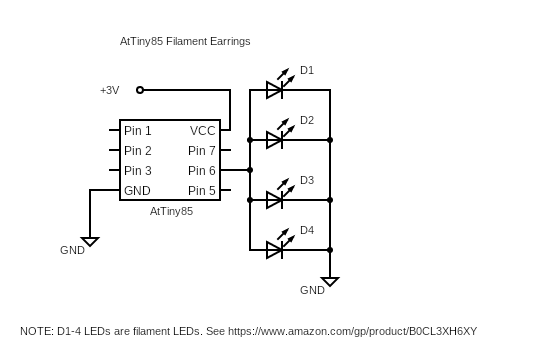

# 24027 - ATTINY85 FILAMENT LED EARRINGS
---

In this project we are introducing a simple circuit and code that will allow you to create fully programmable and customizable earrings. We are also leveraging the mighty power of the ATtiny85 microcontroller.

Following is the circuit diagram of the earring. It is a very simple circuit indeed!

You can access the AtTiny85 software code using the following link. This is a great starting point to create your own LED patterns for the earring!

Though the above code showcases the functionality in our **<u>[project video][1]</u>**, there are many other things you can do by introducing simple modifications to this basic code.

Description: This code creates LED fade and blink patterns for the filament LED earring. Simply enable either of the following #define statements to configure the code to either blink the LEDs in random patterns or to make them fade in and out.
  
#define FADER_EFFECT
#define SPARKLE_EFFECT
  
Please note the randomization of the patterns is achieved through the use of the EEPROM. Therefore, each time the circuit is powercycled, a different random pattern will be observed! 
  
If you build this project, please share your thoughts and suggestions with the rest of circuitapps community in the comments section of **<u>[our YouTube video][1]</u>**. Also, please feel free to talk about any interesting modifications you make and your experimentations!

## Project Challenges
1 - Though this is a simple project, be careful with the polarity of the LEDs when sldering them to the rest of the circuit.

2 - You can get the filament LEDs using **<u>[this link][3]</u>** As these LEDs have ceramic inside them, they are pretty fragile and can crack easily. Therefore, be ccareful while handling them!

## Useful tip

If you have not worked with ATtiny85 before and need support with the basic operation and programming of this device, have a look at this **<u>[excellent reference][2]</u>** that walks you through the entire process step by step. If you get stuck, drop us a message in the comments section of **<u>[our YouTube video][1]</u>**

GOOD LUCK & ENJOY THE PROGRAMMABLE EARRING FOR YOURSELF OR AS A GIFT FOR YOUR LOVED ONES !

[1]: https://youtu.be/szZ8kH5_06M

[2]: https://circuitdigest.com/microcontroller-projects/programming-attiny85-microcontroller-ic-using-arduin

[3]: https://www.amazon.com/gp/product/B0CL3XH6XY